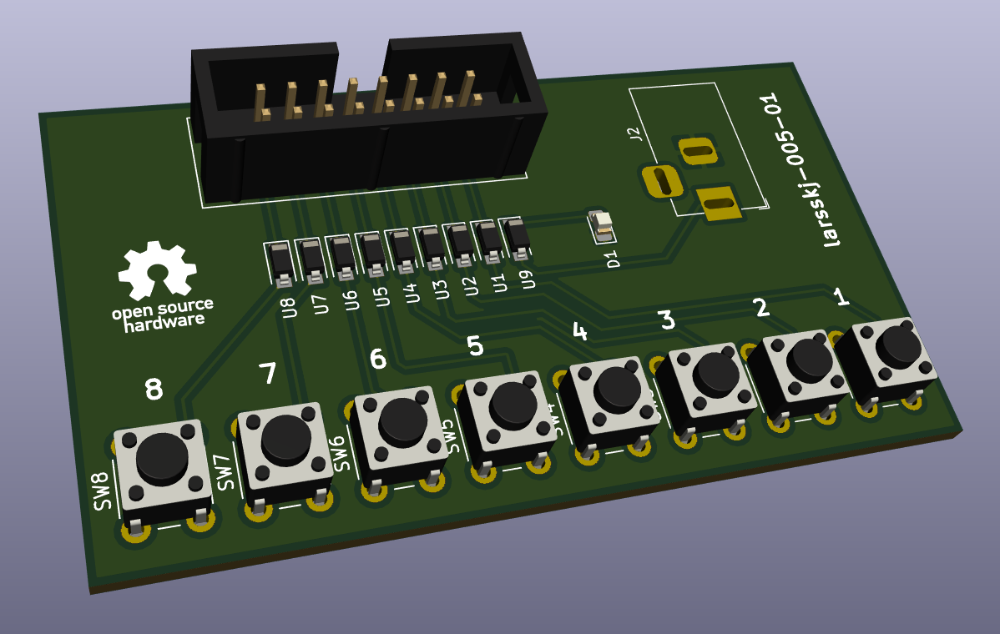

An LED tester for larsskj-003 boards
====================================

### larsskj-005

This board can be used to test LEDs connected to my larsskj-003 boards. It uses a NSI50010YT1G CCR (Constant Current Regulator) to source the LEDs with around 10 mA no matter the supply voltage.

SMD resistors may be used instead.

For more information, visit the [project homepage](https://larsskj.org/projects/larsskj-005).

The files provided are project files for [KiCad 5](http://kicad.org/).

The board is shared at [OSH Park](https://oshpark.com/shared_projects/7hGy0Jvt), where you can order copies.

